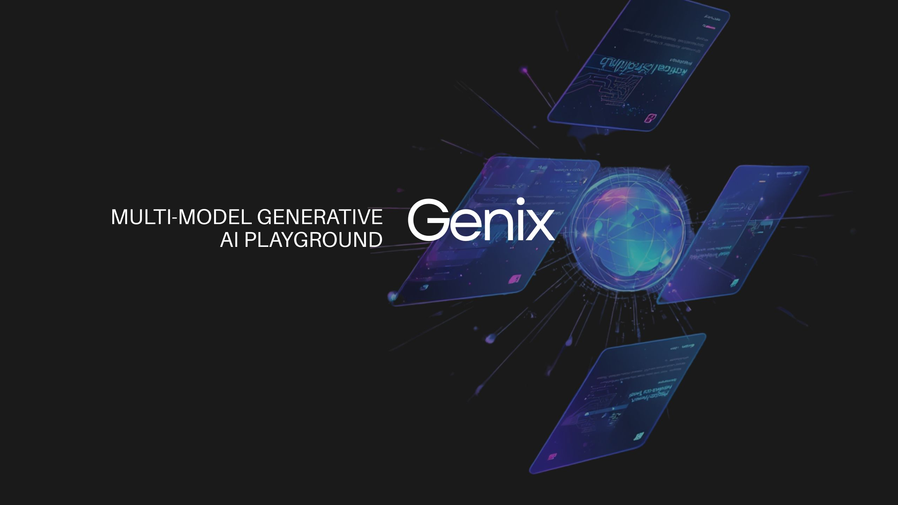
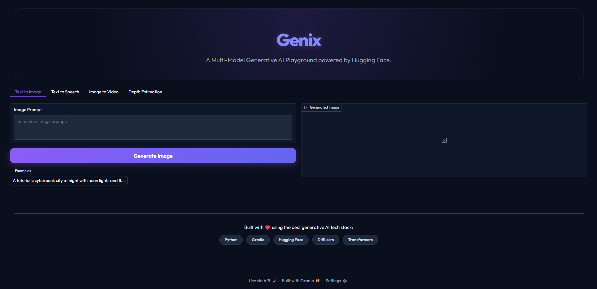
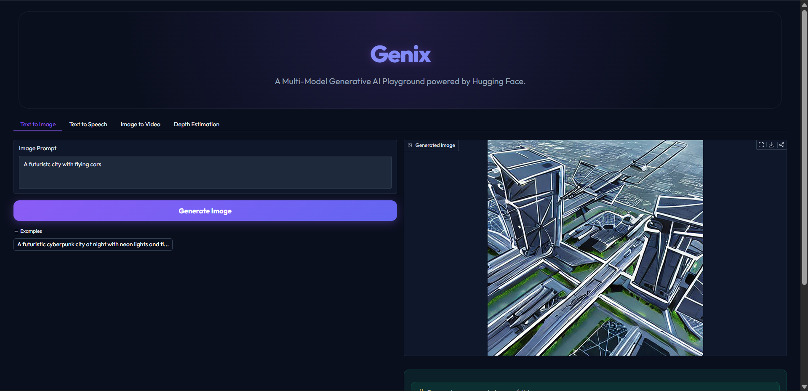
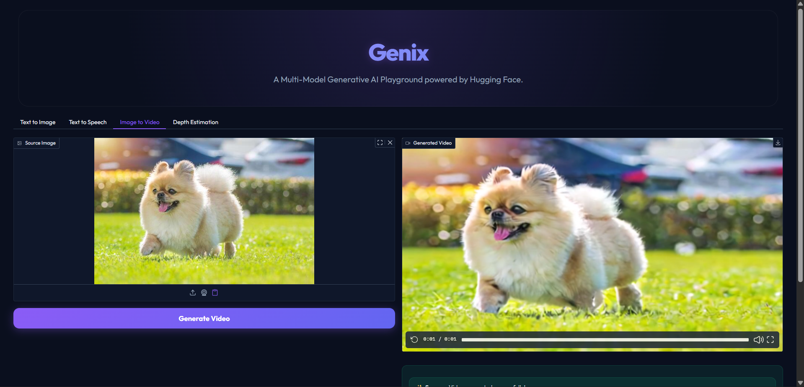
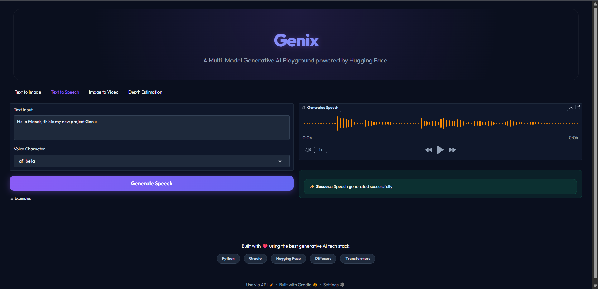
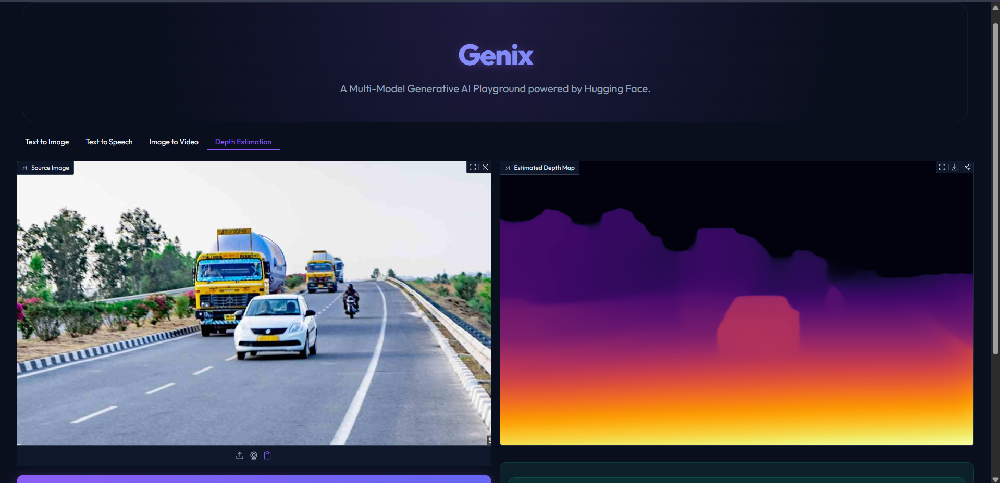

<h1 align="center">
  
  Genix
</h1>

<p align="center">
  <strong>Multi-Model Generative AI Playground</strong>
</p>
<p align="center">

<p align="center">
  
</p>

<p align="center">
  Multi-Model Generative AI Playground
<p align="center">
An AI-powered multi-model generative playground built using <b>Python</b>, <b>Gradio</b>, <b>Hugging Face Diffusers</b>, and <b>Transformers</b>.
</p>

---

# 🚀 Overview

Genix is an all-in-one AI playground that combines multiple state-of-the-art generative AI models into a single modern web interface.

It enables users to generate images, videos, speech, and depth maps while automatically managing GPU resources for efficient inference.

Designed with a modular architecture, Genix allows developers to easily integrate additional AI models and features.

---

# ✨ Features

- 🎨 Text-to-Image Generation
- 🎥 Image-to-Video Generation
- 🎙️ Text-to-Speech Generation
- 🌄 Depth Estimation
- ⚡ CUDA GPU Acceleration
- 🧠 Automatic Model Loading & Memory Management
- 💾 Optimized VRAM Usage
- 🎛️ Interactive Gradio Interface
- 🌙 Responsive Dark Theme
- 📂 Automatic Output Saving

---

# 🤖 AI Models Used

| Feature | Model |
|----------|------|
| Text-to-Image | Runway ML - Stable Diffusion v1 5 |
| Image-to-Video | Stability AI - Stable Video Diffusion img2vid |
| Text-to-Speech | Kokoro-82M |
| Depth Estimation | Intel DPT Large |

---

# 📁 Project Structure

```text
Genix/
│
├── app.py
├── requirements.txt
├── README.md
├── setup.bat
├── run.bat
├── .gitignore
│
├── modules/
│   ├── model_manager.py
│   ├── text_to_image.py
│   ├── image_to_video.py
│   ├── text_to_speech.py
│   └── depth_estimation.py
│
├── outputs/
├── assets/
└── examples/
```

---

# 💻 Recommended Hardware

- Python 3.11
- NVIDIA RTX GPU (CUDA Supported)
- 6 GB+ VRAM Recommended
- Windows 10/11

The application automatically falls back to CPU when CUDA is unavailable.

---

# ⚙️ Installation

Clone the repository

```bash
git clone https://github.com/akshatbindal-075/Genix
cd Genix
```

Create a virtual environment

```bash
python -m venv venv
```

Activate it

Windows

```bash
venv\Scripts\activate
```

Linux/macOS

```bash
source venv/bin/activate
```

Install dependencies

```bash
pip install -r requirements.txt
```

---

# ▶️ Running the Application

Run directly

```bash
python app.py
```

or simply execute

```text
run.bat
```

The Gradio interface will start at

```
http://127.0.0.1:7860
```

---

# 📸 Demo

### Home Page



### Text-to-Image



### Image-to-Video



### Text-to-Speech



### Depth_Estimation



---

# ⚡ Performance

Approximate performance on an NVIDIA RTX 3050 (6 GB):

| Task | Approximate Time |
|------|------------------|
| Text-to-Image | ~15-20 sec |
| Text-to-Speech | ~2–5 sec |
| Depth Estimation | ~2–4 sec |
| Image-to-Video | Depends on model and video length |

---

# 🛠️ Future Improvements

- Multi-model selection
- Image Editing
- Background Removal
- Image Upscaling
- Inpainting
- Outpainting
- Prompt History
- Video-to-Video Generation
- Voice Cloning
- Hugging Face Spaces Deployment

---

# 🤝 Contributing

Contributions are welcome.

1. Fork the repository.
2. Create a feature branch.
3. Commit your changes.
4. Push the branch.
5. Open a Pull Request.

---

# 📝 License

This project is licensed under the MIT License.

---

# 🙏 Acknowledgements

- Hugging Face
- Gradio
- Stability AI
- Intel
- Hexgrad (Kokoro)
- Open Source AI Community

---

# 👨‍💻 Author

**Akshat Bindal**

Built for learning, experimentation, and AI application development.

If you found this project useful, consider giving it a ⭐ on GitHub.
